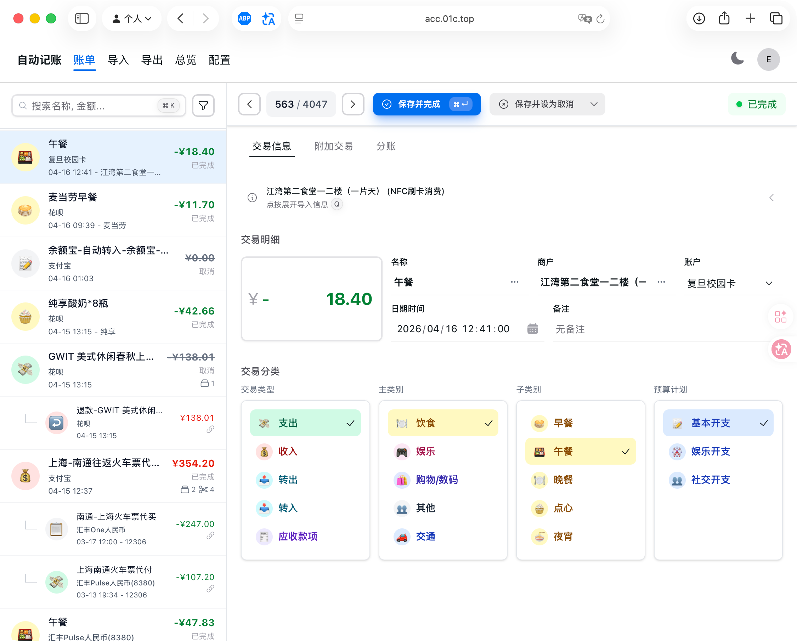
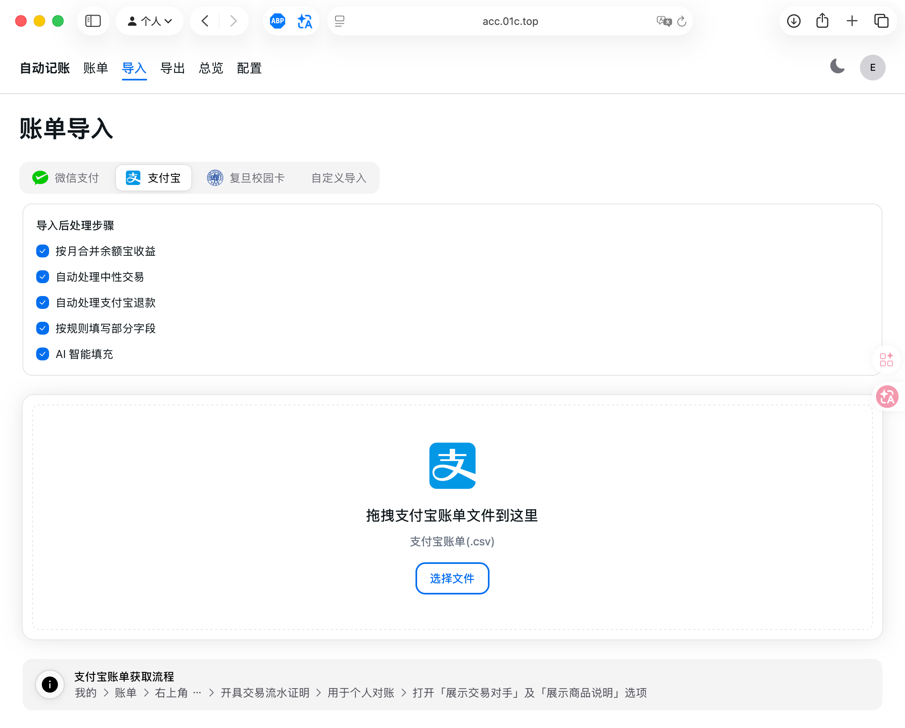

# 自动记账 (Auto Accounting)

一个用于导入、清洗、分类和导出个人账单的辅助记账系统。

## Overview / 项目简介

处理来自不同支付平台和账户系统的流水记录，支持将原始账单导入为统一的交易数据，经过规则、自动处理链和 AI 辅助补全后，再进行人工审核、拆分合并和导出。

项目基于 Next.js 15、React、TypeScript、HeroUI、Tailwind CSS 和 Supabase 构建。Supabase 负责用户认证和数据存储，前端提供账单导入、交易编辑、配置管理和导出页面。

## Features / 功能

- **多来源账单导入**：支持微信支付、支付宝、复旦校园卡账单导入，也支持借助大模型将任意账单文本、截图识别结果或交易记录整理为自定义 JSON 后导入。
- **导入后自动处理**：导入流程会对退款、中性交易、余额宝收益、零钱 / 余额宝互转等记录进行自动识别和处理，减少无效流水对账本的干扰。
- **规则与 AI 辅助分类**：支持配置匹配规则以自动填写分类、预算、名称和商户；对于规则无法覆盖的记录，可使用 AI 辅助补全交易信息。
- **拆分与合并交易**：支持将一笔交易拆分为多条记账记录，也支持将相关流水合并处理，适用于转账、退款、分账等场景。

## Screenshots / 页面预览

### 交易编辑



### 账单导入



## Getting Started / 快速开始

### Requirements / 环境要求

- Node.js 20+
- npm
- Supabase 项目或本地 Supabase CLI

### Installation / 安装

```bash
npm install
```

### Configuration / 配置

复制环境变量示例文件：

```bash
cp .env.example .env.local
```

至少需要配置 Supabase 连接信息：

```env
NEXT_PUBLIC_SUPABASE_URL=your-supabase-url
NEXT_PUBLIC_SUPABASE_ANON_KEY=your-supabase-anon-key
```

如果需要使用 AI 辅助补全交易名称、商户和分类，还需要配置兼容 OpenAI Chat Completions 的模型接口：

```env
API_KEY=your-api-key
BASE_URL=your-base-url
MODEL=your-model
```

数据库表结构可参考 `sql/` 目录下的 SQL 文件。

### Run / 启动

```bash
npm run dev
```

启动后访问 [http://localhost:3000](http://localhost:3000)。

## Usage / 使用方式

1. 在“配置页面”中准备账户、主类别、子类别、预算计划和匹配规则等基础数据。
2. 通过“账单导入”页面上传微信支付、支付宝账单。对于其他来源的账单，可以先借助大模型整理为符合格式的 JSON，再通过“自定义导入”导入。
3. 导入后根据需要启用自动处理步骤，包括退款处理、中性交易处理、规则匹配和 AI 辅助补全。
4. 在交易编辑页检查待处理记录，调整分类、名称、商户、预算计划和交易状态。
5. 对复杂流水进行拆分或合并处理。
6. 在导出页面选择范围并导出为 CSV 文件。

## Project Structure / 项目结构

```text
app/                    Next.js App Router 页面、Server Actions 和布局
components/             页面组件、上下文和业务 UI
lib/                    导入器、导出器、交易处理和 Supabase 封装
sql/                    数据库表结构 SQL
types/                  数据库和业务类型定义
constants/              交易状态、交易类型等常量
email-templates/        注册/密码重置邮件模板
supabase/               本地 Supabase 配置
```

## License / 开源协议

本项目使用 [MIT License](./LICENSE)。
